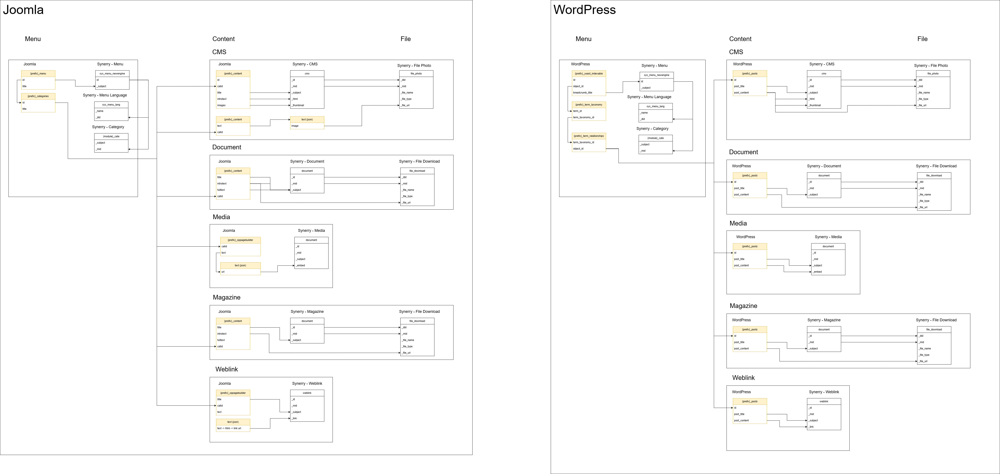

# Setup RESTORE

- ดาวน์โหลดไฟล์ SQL/BAK ของส่วนกลางทั้งหมดจากลิงค์ด้านบน
- แตกไฟล์ที่ดาวน์โหลดมา
- เปิด Navicat SQL Server Management Studio (SSMS) หรือเครื่องมือจัดการฐานข้อมูล SQL Server อื่น ๆ ที่คุณใช้งาน
- เชื่อมต่อกับ MySQL
- สร้างฐานข้อมูลใหม่สำหรับการนำเข้าข้อมูล

```docker-compose
version: '3.8'

services:
  mysql:
    image: mysql:8.0
    container_name: rid_mysql_db
    restart: unless-stopped
    environment:
      MYSQL_ROOT_PASSWORD: rootpassword
      MYSQL_DATABASE: rid_web_db_new
      MYSQL_USER: rid_user
      MYSQL_PASSWORD: rid_password
    ports:
      - "3306:3306"
    volumes:
      - mysql_data:/var/lib/mysql
    command: --default-authentication-plugin=mysql_native_password

volumes:
  mysql_data:
```

- เชื่อมด้วย Root user และรหัสผ่านที่คุณตั้งไว้ในไฟล์ `docker-compose.yml` (ในตัวอย่างนี้คือ `rootpassword`)
- ใช้คำสั่ง SQL หรือเครื่องมือที่คุณเลือกเพื่อนำเข้าข้อมูลจากไฟล์ SQL/BAK ที่ดาวน์โหลดมา
  - หากใช้ Navicat หรือ SSMS ให้เลือกฐานข้อมูลที่สร้างขึ้นแล้วคลิกขวา เลือก "Import" หรือ "Restore" แล้วเลือกไฟล์ BAK ที่ต้องการนำเข้า (ตัวอย่างคือ Navicat) (ใน BAK นามสกุล .nb3 ดีกว่า)
  - หากใช้คำสั่ง SQL ให้ใช้คำสั่ง `SOURCE` หรือ `RESTORE DATABASE` ตามที่มีหรือเครื่องมือที่คุณใช้งาน

ไฟล์ vdo ใหญ่ไป
<div align="center">
  <video src="vdo/restoreDB.mp4" controls width="600" style="margin-top: 10px;">
    Your browser does not support the video tag.
  </video>
</div>

### มาต่อที่ DB rid เรา

- เรามี docker-compose ที่รันไว้แล้ว
- Restore จาก rid_web_db_new (.nb3)

<div align="center">
<video src="vdo/rid-new.mp4" controls width="600">
  Your browser does not support the video tag.
</video>
</div>

## สรุป
เราต้องการฐานข้อมูลที่มีข้อมูลจากส่วนกลาง (BAK) และฐานข้อมูล rid ของเรา (rid_web_db_new) ที่จะใช้ในการทำการย้ายข้อมูล

# Setup เสร็จ เริ่มทำ

- สร้าง folder ของตัวเองตามที่ต้องทำ
- Copy script มาเลย Script ที่สมบูรณ์ที่สุดของแต่ละ schema :
  - Joomla : rio17
  - WordPress : rio7
### Check ก่อนทำ <span style="color:red">อันนี้สำคัญ !! [ยังไม่ได้เขียนต่อ]</span>
  - ถามพี่มาร์ท
  - Check ใน Lark
  - ต้องตรวจข้อมูลที่มีเพราะมันเก็บไม่เหมือนกัน การเขียน script เลยต้องเฟี้ยวหน่อย

ตัวอย่างการเก็บข้อมูลภาพที่ไม่เหมือนกันอันนึงเข้ารหัส อันนึงไม่
```json
{"image_intro":"images\/activities\/2568-2\/\u0e1e\u0e24\u0e29\u0e20\u0e32\u0e04\u0e21\/1-52\/495111295_1124091869758066_2285128351739555337_n_1.jpg#joomlaImage:\/\/local-images\/activities\/2568-2\/\u0e1e\u0e24\u0e29\u0e20\u0e32\u0e04\u0e21\/1-52\/495111295_1124091869758066_2285128351739555337_n_1.jpg?width=1706&height=960","image_intro_alt":"","float_intro":"","image_intro_caption":"","image_fulltext":"","image_fulltext_alt":"","float_fulltext":"","image_fulltext_caption":""}

{"image_intro":"images\/activities\/2568\/160.jpg#joomlaImage:\/\/local-images\/activities\/2568\/160.jpg?width=640&height=359","image_intro_alt":"","float_intro":"","image_intro_caption":"","image_fulltext":"","image_fulltext_alt":"","float_fulltext":"","image_fulltext_caption":""}
```
### เปิด CHAT มา!!!
คำสั่งแก้ sql script (ตัวอย่าง) เอามาจากตาราง all-central **ลบ passed fail ออก**
- prompt
- ตาราง
- site id

```text
this is the migration menu i copies from rio17 : [D:\Mart\Project\rid\database_migration_02\fad],
now make it for migrate fad website,

this is the menu i want to migrate : [cms	ข่าวกิจกรรม	https://link-1	catid = 11
document	หนังสือเวียน	https://link-2	catid = 22
document	คำสั่งกองการเงินและบัญชี	https://link-3	catid = 12
document	รายงานการประชุม	https://link-4	catid = 14
document	รายงานการเงิน กรมชลประทาน	https://link-5	catid = 21]
, 

site id = 4
```
# File ที่ต้องมี
```
📦 File
├─ BAK                                            -- Backup files
│  └─ dump-central-database                       -- Dump files from central database (DB ของเขา)
├─ rid_web_db_new
│  ├─ rid_web_db_new.sql
│  └─ rid_web_db_new.nb                           -- Database dump file (DB ของเรา)
├─ RIO_Example
│  ├─ rio7                                        -- WordPress example
│  └─ rio17                                       -- Joomla example
├─ sql (Same like BAK but sql)                    -- SQL files (ใช้หาขื่อ table)
└─ docker-compose.yml                             -- Docker Compose file for setting up MySQL                
```
©generated by [Project Tree Generator](https://woochanleee.github.io/project-tree-generator)

<div align="center">
  
  </img>
</div>
